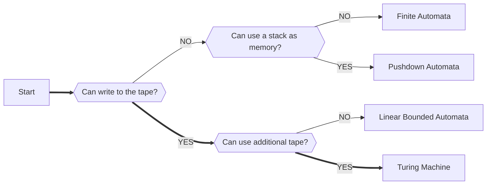
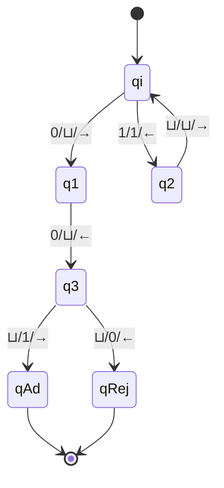

## WEEK I - Automata and Turing Machines

> Outlines:
>
> Involved two types of Finite Automata (DFA & NFA) and two types of Turing Machine (Turing Machine & NDTM)
>
> Some differences between Finite Automata and Turing Machine (just for understanding):  
>
> | DFA                                              | TM                                                           |
> | ------------------------------------------------ | ------------------------------------------------------------ |
> | Recognizes regular languages                     | Recognizes regular languages and context-free, context-sensitive, recursively enumerable languages |
> | L➡️R and L⬅️R: finite length                       | L➡️R: finite length and L⬅️R: infinite length                  |
> | The head can only move in the right direction    | The head can move in both directions                         |
> | The head can only read the symbols from the tape | The head can read and write the symbols on the tape          |
> | Lower computational power                        | More powerful computational power                            |

---

#### 1. Recap for 4CCS1FC1

***Theorem 1.1.*** Considering a DFA (Deterministic Finite Automata) $A = <\Sigma, Q, q_{init}, F, \delta>$, 

- Terminology

  - `Alphabet` - A finite set of symbols. 

    $\Sigma = \{a_0,a_1,...,a_k\}$

  - `Words / Strings` - The set of all finite strings compriesd of letters from the alphabet $\Sigma$. 

    $\Sigma^*=\{ all\ finite\ strings\ from\ \Sigma\}$

  - `Languages` - Any subset of words is consider a language. Including the empty language. 

    $L \subseteq \Sigma^*$
  
- Component

  - `Alphabet`  $\Sigma = \{a_0,a_1,...,a_k\}$
  - `Finite set of control states`  $Q=\{q_1,...,q_n\}$
  - `Initial state`  $q_{init}\in Q$
  - `Final(accepting) state`  $F \subseteq Q$
  - `Trasition function`  $\delta: Q \times \Sigma \to Q$
    
    > i.e. $\delta(current\ state, read\ symbol)\to new\ state$ 
  
- Definition

  - Configuration

    A complete description of the machine at any given time is,
    >(current state, substring to the right of tape head)
  - Computation

    The sequence of configurations obtained by running the DFA is,
    > e.g. $(q_0, 1001) \to (q_1, 001) \to (q_2, 01) \to (q_1, 1) \to (q_0, \epsilon)$
  - Accept Criterion for DFAs
    > **$A$ accept $w$** means
    >
    > The final state of the **(unique)** computation staring $(q_{init}, w)$ is an accepting state. 

***Theorem 1.2.*** Considering a NFA (Non-deterministic Finite Automata) $A = <\Sigma, Q, q_init, F, \delta>$, 

- Component

  - `Alphabet`  $\Sigma = \{a_0,a_1,...,a_k\}$
  - `Finite set of control states`  $Q=\{q_1,...,q_n\}$
  - `Initial state`  $q_{init}\in Q$
  - `Final(accepting) state`  $F \subseteq Q$
  - `Trasition function`  $\delta: Q \times \Sigma \to P(Q)$
    > i.e. $\delta(current\ state, read\ symbol)\to \{all\ possible\ new\ states\}$
  
- Definition

  - Accept Criterion for NFAs
    > **$A$ accept $w$** means
    >
    > The final state of the **ANY** computation staring $(q_{init}, w)$ is an accepting state. 

***Theorm 1.3.*** Every NFA can be **converted** to a DFA that accepts the same language. 

---

#### 2. Regular and Non-regular Language

> ref: 
>
> [Non-regular Languages - Medium](https://medium.com/@yashgaherwar2002/non-regular-languages-904b0c42e06b)
>
> [Slides - Stanford University](https://web.stanford.edu/class/archive/cs/cs103/cs103.1142/lectures/16/Small16.pdf)
>
> [pumping lemma - Zhihu](https://zhuanlan.zhihu.com/p/404708553)

***Theorem 2.1.*** Recap for Regular Expression and Regular Language, 

- Regular Expression

  Any word that can be constructed using only the following rules: 

  - `Concatenation`  $wv$
  - `Alternation / Choice`  $(w \bigcup v)$
  - `Kleene Star`  $w*$
  
- Regular Language

  Any set of words that can be 'represented' by a regular expression.
  - Has an unique equivalent DFA
  - Can be read by NFAs
  - Can be read by readable-only Turing Machines
  - Can be described by regular expression

***Theorm 2.2.*** Not all langauges are regular. 

***Example 2.1.***   Prove that $L=\{a^nb^n|n\in \mathbb{N}\}$ is non regular language. 

> If *D* is a DFA for $L$, when *D* is running on two different inputs $a^m$ and $a^n$, *D* must end in different states. 
>
> > Suppose *D* is a DFA that overcomes the contridaction in 1., i.e., different inputs $a^m$ and $a^n$ will end in a same state. Since *D* is deterministic, different inputs $a^nb^n$ and $a^mb^n$.
> >
> > - If this state is accepting, then *D* accpets $a^mb^n$, which is not in $L$.
> >
> > - If this state is rejecting, then *D* accpets $a^nb^n$, which is in $L$. 
> >
> > Thus, *D* must end in different states.
>
> Assume $L$ is regular. Since $L$ is regular, there must be a DFA *D* for $L$. 
>
> Let *n* be the number of states in *D*. When *D* in run on strings $a^0$, $a^1$..., and $a^n$, since there are *n+1* strings and *n* states, at least two of these strings must end in the same state. 
>
> Q.E.D. The assumenation is impossible. 

***Theorem 2.3.*** The Pumping Lemma. 

Let $L \subseteq \Sigma^* $ be an infinite language. If $L$ is **regular** language then there is some $p>0$ such that, every word $w \in L$ of length $|w|\geq p$ can be written in the form $w = xyz (x, y, z \in \Sigma^*)$, such that: 

  - $|xy|\leq p$,
  - $|y|>0$, and
  - $xy^nz \in L$ for all $n \geq 0$.

i.e., If $L$ is regular language, taking $xyz \in L$, then $xy^iz\geq0 \in L$. 

***Proof 2.3.*** Not required. See ref. 

This theory could be used to identify whether a language is regular or not. 

***Example 2.2.*** Prove $L = \{a^nb^m: n<m\}$ is non-regular language.

> Assume $L$ is regular language, and assume $p>0$, according to ***Theorem 2.3.***, there exists a string $s=a^pb^p=xyz$ which can never statisfy the following conditions: 
>
> - Assume $y$ contains only the character $a$, i.e., $y=\{a^n | n \in N^+\}$, then $xyyz \notin L$, so $y$ must contain character $b$.
> - Assume $y$ contains only the character $b$, then $xyyz \notin L$ as well, so $y$ must contain character $a$. i.e., $y$ must contain both $a$ and $b$.
> - Since $|xy|\leq p$ and $|y|>0$, the first $p$ characters of the string can only contain $a$, so $y$ can only contain character $a$. So the assumption is **false**. 
>
> Therefore, $L$ is not regular. 

***Example 2.3.*** Considering $L=\{m^bm^b\#mmmmm^b | b \in N\}$ over alphabet $\sigma = \{m, \#\}$, Prove $L$ is non-regular language.

> Assume $L$ is regular language, and assume $q>0, p=2q+1$, according to ***Theorem 2.3.***, there exists a string $s=m^{2q}\#m^{4+q}=xyz$ which can never statisfy the following conditions: 
> 
> - Since $xy^nz \in L$ for all $n \geq 0$ and there is only one character $\#$ in the string, so $y$ can only contain the character $m$. 
> - Since $|xy|\leq p$ and $|y|>0$, the $p_{th}$ character of the string must be the character $\#$, so $y$ must end with $\#$. So the assumption is **false**. 
> 
> Therefore, $L$ is not regular. 

---

#### 3. Turing Machines

> ref: 
>
> [configuration of Turing Machine](https://www.cs.odu.edu/~toida/nerzic/390teched/tm/definitions.html)

***Theorem 3.1.*** Considering a Turing Machine $M = <\Sigma, Q, q_{init}, q_{accpet}, q_{reject}, \delta>$,

  - Component

    - `Alphabet`  $\Sigma = \{a_1, ..., a_k\}$
    - `Finite set of control states`  $Q = \{q_1,...,q_n\}$
    - `Initial state`  $q_{quit} \in Q$
    - `Accept and Reject states`  $q_{accept}, q_{reject} \in Q$
    - `Transition function`  $\delta:(Q\times\Sigma\bigcup\{⊔\})\to (Q\times\Sigma\bigcup\{⊔\}\times\{←,→\})$
    > i.e., $\delta(\text{current state, read symbol})\to (\text{new state, write, move})$

  - Definition
    - Configuration
    
      A complete description of the machine at any given time:
      >   $\text{(current state, left substring, right substring)}$
    - Computation
    
      The sequence of configurations obtained by running the TM
    - Accept Criterion
      >  **$M$ accepts $w$** means
      >
      >  $M$ terminates and the final state of the computation starting $(q_{init}, \epsilon, w)$ is the accepting state $q_{accept}$. 

***Example 3.1.*** Design a Turing Machines $M$ with the following features: 

  - $M$ has at least one accpeting computation on the input $w$ = 001
  - $M$ has at least one rejecting computation on the input $w$ = 001 
  - $M$ has at least one non-terminating computation on the input $w'$ = 110

> Notation: 
>
> - *a*/*b*/←(→) implies if current state receive a char *a*, it will be replaced as *b*, and the head will turn to the *left* (*right*) position.
> - ⊔ means empty
> 
> Notes: 
> - for input 001: 
>   1. qi -> q3
>   2. two available choices: qAd and qRej
> - for input 110:
>   1. qi -> q2
>   2. q2 -> qi
>   3. Repeat the step 1. and 2., so there will be no result for this input

***Theorem 3.2.*** Decision Procedure

- Definition: 

  - A decision procedure is a procedure that **provides a yes or no answer** for a decision problem. 

  - We used the following notation as a **shorthand** to describe the behaviour of $M$ on input word $w$: 

    $M(w):=\begin{cases}1&\text{if } M\text{ accepts }w\\0&\text{if } M\text{ rejects }w\\↑&\text{if } M\text{ dose not hold on }w\end{cases}$

- Terminology
  - A machine $M$ is said to **decide** a language $L$ if it is: 
    
    - Sound (w.r.t. $L$)
      > i.e., If $M(w)=1$ then $w \in L$
    - Complete (w.r.t. $L$)
      > i.e., If $w \in L$ then $M(w)=1$
    - Terminating
      > i.e., $T_M(w) < \infty $ is finite for all $w \in \Sigma^*$
    
  - An alternative explanation: A machine $M$ is said to **decide** a language $L$ if and only if: 
  
    -  $T$ writes "yes" (accept) and halts if a string is in $L$, and
    -  $T$ writes "no" (reject) and halts if a string is not in $L$. 
  
  - The language decided by $L$ is the set: 
  
    $Language(M)=\{w \in \Sigma^*|M(w) \text{ accepts } w\}$
---

#### 4. Non-Deterministic Turing Machines (NDTMs)

***Theorem 4.1.*** Considering a NDTMs $M = <\Sigma, Q, q_{init}, q_{accpet}, q_{reject}, \delta>$, 

- Component

  - Transition function $\delta:(Q \times \Sigma \bigcup \{⊔\}) \to P(Q \times \Sigma \bigcup \{⊔\} \times \{←, →\})$

    > i.e. $\delta(\text{current state, read symbol}) \to \{\text{possible instructions}(state,write,move)\} $

  - Definition

    - Configuration

      The **configurations** of a NDTM are defined as for deterministic Turing Machines as a complete description of the machine at any given time.
      > (current, left substring, right substring)
    - Computations

      The **computations** of a NDTM are all possible sequences of configurations obtained by running $M$ on a given input. Which can be arranged into a branching <u>computation tree</u> with each branch corresponding to a possible computation of $M$. 
    - Accept Criterion for NFAs
      > **$M$ accepts $w$** means
      > 
      > The final state of the **ANY** computation staring $(q_{init}, \epsilon, w)$ is an accepting state. 

***Theorem 4.2.*** The Church-Turing Thesis

  Every language that can be recognised by a **non-deterministic** TM can be recongised by a **deterministic** TM. 

***Proof 4.2.*** Given a NDTM $M$,
  > We can construct a TM $M'$ that writes out **all configurations** appearing in the branching computation tree of $M$. 
  >
  > The  machine $M'$ enters the **accepting state** if it ever writes a configuration with whose state is the accepting state of $M$. 
