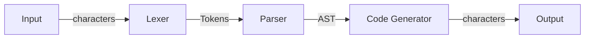

## WEEK I - Introduction to Compiler

>[🏠 MENU - 6CCS3CFL](year3/6ccs3cfl.md)
>
>⏹️
>
>[➡️ WEEK II - Matching Algorithm](year3/6ccs3cfl/w2.md)
>
>Outlines:
>
>1. Basic Concepts of Compiler
>     - Introduction
>     - Components
>       - Lexer
>         - Parser
>         - Code Generator
>2. Matcher
>    - Motivation
>    - Regexes
>        - Terminologies
>          - String, Languages
>    - Meaning of regular expression
>    - Meaning of Matching

### 1.1. Basic Concepts of Compiler

##### 1.1.1. Introduction to Compiler

- Reason for Compiler

  - Hardwares is getting more and more different nowadays. 
  - Low-level languages have more security risks. We want a higher level language for programming. Compilers can help in mitigating this gap. 

- Functions of Compiler

  

  - Transforming strings into structured data
    - *Lexing* - recognising words basing on regular expression
    - *Parsing* - recognising sentences
  - Code generation for a small imperative and a small functional language
    - *Interpreters* - directly runs a program
    - *Compilers* - generate JVM code and LLVM-IR code

##### 1.1.2. Components



- Lexer
  - Split the input characters into tokens by using matcher.
  - Matcher
    - Identify the pattern and structure for the input data.
    - Derivate the input data into different symbols according to the regular expression. 
  - Basis for syntactical analysis. 
  - Ignore the useless information, e.g., blanks or documentation. 
  - Identity keywords, variables, operators, etc. 
- Parser
  - Convert tokens into abstract syntax tree. 
  - Identity and verify the code structure. 
- Code Generator
  - Convert the abstract syntax tree into the target code. e.g., assembling language, bytes, machine code, etc. 

---

### 1.2. Matcher

##### 1.2.1. Motivation

- Text Processing

  - We want to extract information following specific patterns from the input data.

  - **Regular expressions** help with pattern matching. 

    > e.g.
    >
    > `[a-z0-9_.-] + @ [a-z0-9.-] + .[a-z.]{2, 6}` is a regular expression for identifying email address.
    >
    > - Legal strings following this pattern including 
    > 	`very.common@example.co.uk`
    > 	`niceandsimple@example.org`
    > - Ilegal examples including
    > 	`user@localserver`
    > 	

##### 1.2.2. Regexes

- Extended regular expressions in Scala

  ```scala
  re*				// matches 0 or more occurrences of preceding expression
  re+				// matches 1 or more occurrences of preceding expression
  re?				// matches 0 or 1 occurrence of preceding expression
  re{n}			// matches exactly n number of occurences of preceding expression
  re{n, m}	// matches at least n and most m occurences of the preceding expression
  [...]			// matches any single character inside the brackets
  [^...]		// matches any single character not inside the brackets
  ...-...		// character ranges
  \d				// matches digits; equivalent to [0-9]
  .					// matches every character except newline
  (re)			// groups regular expressions and remembers matched text
  ```

- Motivation

  - Evil Regular Expressions
    
    - Inapporiate implementation of the matcher has exponential time complexity. 

      - Can lead to a backtracking or crush for the OS. 
      - Can be used for cyber attack.
    
    - *Regular expression Denial of Service (ReDoS)*
    
      - Cyber attack by using evil regular expressions to run out the server resources. 
    
      > Once occurred for Network Intrusion Detection systems, Cloudflare, StackExchange, Atom editor, etc.
    
  - We will have a more efficient implementation for regex matcher. 
  
  - We use basic regular expressions despite of the extend version from Scala. 


##### 1.2.3. Terminologies

- Basic Regular Expressions 

  - Definition
  	$$
  	\begin{array}{lcll}
  	r &::= &\textbf{0}				&\text{Nothing} \\
  	~		&| &\textbf{1}				&\text{Empty String} \\
  	~		&| &c				&\text{Character} \\
  	~		&| &r_1 + r_2		&\text{Alternative/Choice} \\
  	~		&| &r_1 \cdot r_2		&\text{Sequence} \\
  	~		&| &r^*			&\text{Repeat with zero or more times} \\
  	\end{array}
  	$$
  - Code implementation
  	```scala
  	abstract class Rexp
  	case object ZERO extends Rexp
  	case object ONE extends Rexp
  	case class CHAR(c: Char) extends Rexp
  	case class ALT(r1: Rexp, r2: Rexp) extends Rexp 
  	case class SEQ(r1: Rexp, r2: Rexp) extends Rexp 
  	case class STAR(r: Rexp) extends Rexp
  	```

- String

  - Definiton
    - A **string** is a list of characters. 
      > e.g. 
      >
      > `"Hello" == ['h', 'e', 'l', 'l', 'o']`

  - Empty String - `"" or []`
  - Concatenation of two strings

    $s_1 @ s_2$

    > e.g.
    >
    > `foo @ bar = foobar`

- Langauge
  - Definition
    - A **language** is a list of strings.
      > e.g.
      >
      > `{[], hello, foobar, a, abc}`

  - Concatenation of strings and languages

    $A@B \mathop{=}\limits^{def} {s_1@s_2 | s_1 \in A ∧s_2 \in B}$

    >e.g.
    >
    >`Let`
    >
    >`A = {foo, bar} `
    >
    >`B = {a,b}`
    >
    >`A @ B = {fooa, foob, bara, barb}`


##### 1.2.4. The Meaning of a Regular Expression

- Definition
  - To define the meaning of a regular expression we will *associate with every regular expression a language*, which contains all the strings the regular expression is supposed to match. 
  - The meaning of a regular expression can be defined by a recursive function $L$, defined as follows:
  $$
  \begin{array}{lll}
  L(0) &\mathop{=}\limits^{def}  &\{\} \\
  L(1) &\mathop{=}\limits^{def} &\{[]\} \\
  L(c) &\mathop{=}\limits^{def} &\{[c]\} \\
  L(r_1+r_2) &\mathop{=}\limits^{def} &L(r_1) \cup L(r_2) \\
  L(r_1 \cdot r_2) &\mathop{=}\limits^{def} &\{s_1 @ s_2 | s_1 \in L(s_1) \wedge s_2 \in L(r_2) \} \\
  L(r^*) &\mathop{=}\limits^{def} &\cup_{0 \leq n} L(r)^n \\
  \end{array}
  $$

  - Examples

    > e.g.
    >
    > $L(\text{h · e · l · l · o}) = \{\text{"hello"}\}$

- Operations

  - Power
    $$
    \begin{array}{lll}
    A^0 &\mathop{=}\limits^{def} &\{[]\} \\
    A^{n+1} &\mathop{=}\limits^{def} &A @ A^n \\
    \end{array}
    $$
  - Kleene Star
    $$
    A \star \mathop{=}\limits^{def} \cup_{0 \leq n} A^n
    $$
    
    > i.e., $A^0 \cup A^1 \cup A^2 \cup ...$


##### 1.2.5. Meaning of Matching

- Regular Expression

  - A regular expression $r$ matches a string $s$, provided $s \in L(r)$

  > e.g.
  >
  > Say $A = \{[a], [b], [c], [d]\}$. 
  >
  > How many strings are in $A^4$ ?
  >
  > $4^4=256$