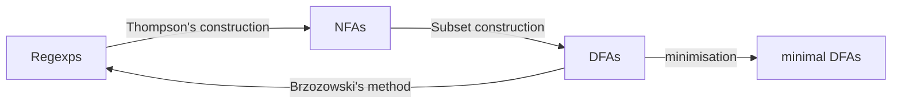

## WEEK III - Automata & Regular Languages

>[🏠 MENU - 6CCS3CFL](year3/6ccs3cfl.md)
>
>[⬅️ WEEK II - Matching Algorithm](year3/6ccs3cfl/w2.md)
>
>[➡️ WEEK IV - Lexing](year3/6ccs3cfl/w4.md)
>
>Outlines:
>
>1. Automata
>    - Motivation
>    - DFA
>    - NFA
>    - Epsilon NFAs
>      - Thompson Construction
>      - Subset Construction
>2. Regexps and Automata
>
>      - Relationships
>
>      - DFA Minimisation
>
>      - Brzozowski's Method

### 3.1. Automata

##### 3.1.1. Motivation

- Consider the (basic) regular expressions. 
  - How about ranges $[a-z], r+, \sim r$? 
  - Do they increase the set of languages we can recognise?

- Introduce DFA to determine the regular expression for specific requirements. 

##### 3.1.2. Deterministic Finite Automaton (DFA)

- A **deterministic Finite Automaton (DFA)** $A$ is given by a five tuple written $A(\Sigma, Q_s, Q_0, F, \delta)$, where contains

  - An alphabet $\Sigma$, 
  - A set of states $Q$, and
    - One of these states is the start state $Q_0$
  - Some states are accepting states $F$, 
  - A transition function $\delta$, 
    - which takes a state as argument and a character and produces a new state; this function might not be everywhere defined $\implies$ partial function

- Example

  > e.g.
  >
  > ```mermaid
  >    stateDiagram-v2
  >    direction LR
  >    classDef end fill:white, font-weight:bold, color:grey;
  > 	 
  > 	 [*] --> Q0
  > 	 Q0 --> Q1: a
  > 	 Q0 --> Q2: b
  > 	 Q1 --> Q4: a
  > 	 Q1 --> Q2: b
  > 	 Q2 --> Q3: a
  > 	 Q2 --> Q2: b
  > 	 Q3 --> Q4: a
  > 	 Q3 --> Q0: b
  > 	 Q4 --> Q4: a, b
  > 	 Q4:::end
  > 	
  > ```
  >
  > for this automaton $\delta$ is the function
  >
  > $\begin{matrix}(Q_0, a) \to Q_1 \\ (Q_0, b) \to Q_2\end{matrix} \ ...$ 

- Properties

  - The start state can be an accepting state. 
  - It is possible that there is no accepting state.
  - All states might be accepting (but this does not necessarily mean all strings are accepted). 

- Accepting a String

  - Given $A(\Sigma, Q, Q_0, F, \delta)$

  - In order to define whether a language is accepted by an automaton, we can define the transition function from characters to strings as follows, 
    $$
    \hat{\delta}(Q, []) \overset{def}= Q \\
    \hat{\delta}(Q, c :: s)  \overset{def}= \hat{\delta}(\delta(Q, c), s)
    $$
  
  - A string $s$ is accepted by $A$ if and only if $\hat{\delta} (Q_0, s) \in F$. 

- DFA and Regular Languages

  - A **language** is a set of strings.
  - A **regular expression** specifies a language. 
    - A language is regular if and only if <u>there exists a regular expression</u> that recognises all its strings, or equivalently, 
    - A language is regular if and only if <u>there exists a deterministic finite automaton</u> that recognises all its strings.
    - Not all languages are regular. e.g., $a^nb^n$. 

##### 3.1.3. Non-Deterministic Finite Automata (NFA)

- A Non-Deterministic Finite Automata (NFA) $A$ is given as a five-tuple $A(\Sigma, Q_s, Q_{s_0}, F, \rho)$, which contains

  - An alphabet $\Sigma$, 
  - A finite set of states $Q_s$,
  - Some these states are the start states $Q_{s_0}$,
  - Some accepting states $F$, and
  - <u>Transition relation $\rho$</u>

- Example

  > e.g.
  >
  > ```mermaid
  > stateDiagram-v2
  > 	direction LR
  >   	classDef end fill:white, font-weight:bold, color:grey;
  > 	
  > 	[*] --> Q0
  > 	Q0 --> Q1: a
  > 	Q0 --> Q0: b
  > 	Q1 --> Q1: a, b
  > 	Q1 --> Q0: b
  > 	Q0 --> Q2: a
  > 	Q1 --> Q2: a
  > 	Q2:::end
  > ```

##### 3.1.4. Epsilon NFAs

- Definition

  - We use *Thompson Construction* to transform a regular expression into a corresponding automaton. 
  
    - This method is by recursion over regular expressions and depends on the non-determinism in NFAs. 
    - However, this also introduce silent transitions in NFAs. (Empty character)
    - Details can be found from 5CCS2FC2. 
  
  - The NFAs with silent transitions are called $\epsilon$NFAs. 
  
    > e.g.
    >
    > ```mermaid
    >    stateDiagram-v2
    > 	 classDef end fill:white, font-weight:bold, color:grey;
    > 	
    > 	 [*]-->Q0
    > 	 Q2:::end
    > 
    > 	 Q0 --> Q1: ε
    > 	 Q0 --> Q0: a
    > 	
    > 	 Q1 --> Q1: a
    > 	
    > 	 Q0 --> Q2: ε
    > 	 Q2 --> Q2: b
    > ```
  
- Thompson Construction

  ```mermaid
    stateDiagram-v2
  	direction LR
  	[*] --> Q
  	
  	note right of Q
    	Regular Language: 0
    end note
  ```
  ```mermaid
    stateDiagram-v2
  	direction LR
  	classDef end fill:white, font-weight:bold, color:grey;
  	
  	[*] --> Q
  	Q:::end
  	
  	note right of Q
    	Regular Language: 1
    end note
  ```
  ```mermaid
    stateDiagram-v2
  	direction LR
  	classDef end fill:white, font-weight:bold, color:grey;
  	
  	[*] --> Q1
  	Q1 --> Q2: c
  	Q2:::end
  	
  	note right of Q2
    	Regular Language: c
    end note
  ```

- Standard Syntax

  - $r_1 \cdot r_2$
  - $r_1 + r_2$
  - $r^*$

- Subset Construction

  - Get Regular Expressions from Automata

    > e.g.
    >
    > ```mermaid
    >   stateDiagram
    >   classDef end fill:white, font-weight:bold, color:grey;
    > 
    >   [*]-->0
    >   0-->0: a, b
    >   0-->1: b
    >   1-->2: a, b
    >   2:::end
    > ```
    >
    > | states     | a      | b         |
    > | ---------- | ------ | --------- |
    > | {}         | {}     | {}        |
    > | {0}        | {0}    | {0, 1}    |
    > | {1}        | {2}    | {2}       |
    > | {2}*       | {}     | {}        |
    > | {0, 1}     | {0, 2} | {0, 1, 2} |
    > | {0, 2}*    | {0}    | {0, 1}    |
    > | {1, 2}*    | {2}    | {2}       |
    > | {0, 1, 2}* | {0, 2} | {0, 1, 2} |
    >
    
    > e.g.
    >
    > ```mermaid
    >   stateDiagram-v2
    > 	classDef end fill:white, font-weight:bold, color:grey;
    > 
    > 	[*]-->Q0
    > 	Q2:::end
    > 
    > 	Q0 --> Q1: ε
    > 	Q0 --> Q0: a
    > 
    > 	Q1 --> Q1: a
    > 
    > 	Q0 --> Q2: ε
    > 	Q2 --> Q2: b
    > ```
    >
    > | states     | a         | b    |
    > | ---------- | --------- | ---- |
    > | {}         | {}        | {}   |
    > | {0}        | {0, 1, 2} | {2}  |
    > | {1}        | {1}       | {}   |
    > | {2}*       | {}        | {2}  |
    > | {0, 1}     | {0, 1, 2} | {2}  |
    > | {0, 2}*    | {0, 1, 2} | {2}  |
    > | {1, 2}*    | {1}       | {2}  |
    > | {0, 1, 2}* | {0, 1, 2} | {2}  |

### 3.2. Regular Expressions and Automata

##### 3.2.1. Relationships



##### 3.2.2. DFA Minimisation

- Motivation

  - We can mremove the unneeded states from the constructed NFAs. 

- Process

  1. Take all pairs $(q,p)$ with $p \neq q$. 

  2. Mark all pairs that accepting and non-accepting states. 

     > i.e., Mark the pairs for accepting states with all the non-accepting states. 

  3. For all unmarked pairs $(q,p)$ and all characters $c$ test whether
     $$
     (\delta(q, c), \delta(p, c))
     $$
     are marked. If yes in at least one case, then also mark $(q, p)$. 

     > i.e., All the pairs that could be connected by only 1 transit. 

  4. Repeat last step until no change.

  5. All unmarked pairs can be merged.

- Example

  > e.g.
  >
  > ```mermaid
  >   stateDiagram-v2
  > 	direction LR
  > 	classDef end fill:white, font-weight:bold, color:grey;
  > 	
  > 	[*] --> Q0
  > 	Q4 ::: end
  > 	
  > 	Q0 --> Q1: a
  > 	Q0 --> Q2: b
  > 	Q1 --> Q4: a
  > 	Q1 --> Q2: b
  > 	Q2 --> Q3: a
  > 	Q2 --> Q2: b
  > 	Q3 --> Q4: a
  > 	Q3 --> Q0: b
  > 	Q4 --> Q4: a, b
  > 
  > ```
  >
  > By step 1 and 2, we consider essentially a table with "**x**". By repeating step 3 we get a table with "**X**". 
  >
  > | **Q1** | X      |        |        |        |
  > | ------ | ------ | ------ | ------ | ------ |
  > | **Q2** |        | **X**  |        |        |
  > | **Q3** | **X**  |        | **X**  |        |
  > | **Q4** | **x**  | **x**  | **x**  | **x**  |
  > |        | **Q0** | **Q1** | **Q2** | **Q3** |
  >
  > This means we can merge $Q_0, Q_2$ and $Q_1, Q_3$ as follows
  >
  > ```mermaid
  > stateDiagram-v2
  > 	direction LR
  > 	classDef end fill:white, font-weight:bold, color:grey;
  > 	
  > 	[*] --> Q0,2
  > 	Q4 ::: end
  > 	
  > 	Q0,2 --> Q1,3: a
  > 	Q0,2 --> Q0,2: b
  > 	Q1,3 --> Q4: a
  > 	Q1,3 --> Q0,2: b
  > 	Q4 --> Q4: a, b
  > 
  > ```

- Alternatives

  - Exchange initial / accepting states
  - Reverse all edges
  - Subset construction to get DFA
  - Remove dead states
  - Repeat once more to get minimal DFA


##### 3.2.3. Brzozowski's Method

- Motivation
  - Convert DFAs into Regular Expressions. 
  - It is possible since every finite set of strings is a regular language. 
- Example
  
  > e.g.
  >
  > ```mermaid
  >   stateDiagram-v2
  > 	direction LR
  > 	classDef end fill:white, font-weight:bold, color:grey;
  > 
  > 	[*]-->Q0
  > 	Q2 ::: end
  > 	
  > 	Q0-->Q1:a
  > 	Q0-->Q0:b
  > 	Q1-->Q0:b
  > 	Q1-->Q2:a
  > 	Q2-->Q2:a
  > 	Q2-->Q0:b
  > ```
  >
  > We can write the following equation to frepresent this graph
  > $$
  > \begin{array}{lll}
  > Q_0 &= &Q_0b + Q_1b +Q_2b + 1 \\
  > Q_1 &= &Q_0a \\
  > Q_2 &= &Q_1a + Q_2a \\
  > \end{array}
  > $$
  >
  > We can therefore eliminate $Q_1$ from the system by just substituting this equation into the other two. This gives
  > 
  > $$
  > \begin{array}{lll}
  > Q_0 &= &Q_0b + Q_0ab +Q_2b + 1 \\
  > Q_2 &= &Q_0aa + Q_2a
  > \end{array}
  > $$
  >
  > Since the Arden's Lemma: If $q=qr+s$ then $q = sr^*$
  >
  > We can get that $Q_2 = Q_0 aa (a^*)$
  >
  > Thus, 
  > $$
  > \begin{array}{lll}
  > Q_0 &= &Q_0 (b+ab+aa(a^*)b)+1 \\
  > ~ &= &(b+ab+aa(a^*)b)^*
  > \end{array}
  > $$
  > Finally, 
  > $$
  > \begin{array}{lll}
  > Q_0 &= &(b+ab+aa(a^*)b)^* \\
  > Q_1 &= &(b+ab+aa(a^*)b)^*a \\
  > Q_2 &= &(b+ab+aa(a^*)b)^*aa(a^*) \\
  > \end{array}
  > $$
- Regular languages are closed under negation
  - But requires that the automaton is completed. 

