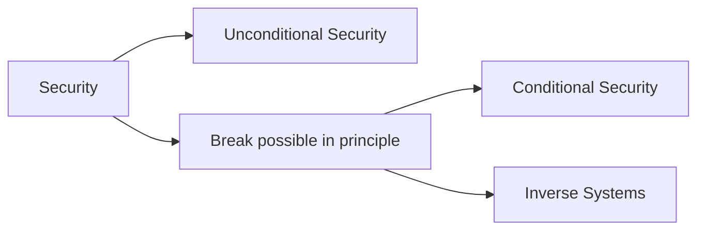

## WEEK II - Formal Cryptographic Scheme

>[🏠 MENU - 6CCS3CIS](year3/6ccs3cis.md)
>
>[⬅️ WEEK I - Introduction to Cryptography](year3/6ccs3cis/w1.md)
>
>[➡️ WEEK III - Transposition and Subsitution Ciphers](year3/6ccs3cis/w3.md)
>
>Outlines:
>
>1. General Cryptographic Scheme
>2. Mathematical Formalization
>    - Notation
>    - Encryption and Decryption
>    - Characteristics
>      - Symmertric vs. Asymmertric
>      - Block cipher vs. Stream cipher
>3. Symmetric-key Encryption
>    - Symmertric CIpher Model
>        - Security
>          - 2 Requirements
>          - Key points - Keep the key secure
>    - Detailed Model
>4. Cryptanalysis and Brute-force Attacks
>    - Two approaches to recover the secret keys (so to get all the furture encrypted messages)
>

### 2.1. General Cryptogrpahic Scheme

> Note.
>
> This section is a more example-based definition about the cryptogrpahic scheme, respectively to *section 1.1*. 

##### 2.1.1. General Model for (Network) Security


- Model Properties

  - A **message** is to be transferred from one principal (Sender) to another (Recipient) across some sort of Internet service. 
  - The two principals must cooperate for the exchange to take place.
  - A logical information channel is estabilished by defining a route through Internet from source to destination and by principals' cooperative use of communication protocols (e.g., TCP/IP).

- All the techniques for providing security have two components

  1. A **security-related transformation** on information to be sent.

     > e.g.
     >
     > - **encryption** of the message, which "scrambles" the message so that it is unreadable by the opponent, and/or
     > - addition of a **code** based on the contents of the message, which can be used to verify the identity of the sender (e.g., MAC or MDC).

  2. Some **secret information** shared by the two principals and, it is hoped, unknown to the opponent. 

     > e.g.
     >
     > - **encryption key** used in conjunction with transformation to "scramble" message before transmission and unscramble it on reception.

- A **trusted third party** may be needed to achieve secure transmission. 

  > e.g.
  >
  > - Responsible for distributing the secret information to the two principals while keeping it from any opponent, or
  > - Needed to arbitrate disputes between the two principals concerning the authenticity of a message transmission.

- Basic Tasks

  - <u>Design an algorithm</u> for performing the security-related transformation. The algorithm should be such that an opponent cannot defeat its purpose.
  - <u>Generate the secret information</u> to be used with the algorithm. 
  - Develop methods <u>for the distribution and sharing</u> of the secret information.
  - <u>Specify a protocol</u> to be used by the two principals that makes use of the security algorithm and the secret information to achieve a particular security service.


##### 2.1.2. General cryptographic schema

- Terminology

  > ```mermaid
  > graph LR
  >		P(Plaintext P) --key1--> E[Encryption]
  >		E --> C(Ciphertext C)
  >		C --key2--> D[Decryption D]
  >		D --> P
  > ```
  > 
  > where $E(k_1, P) = C$ and $D(k_2, C)=P$. 
  
  - *Plaintext* - text that can be read and understood (e.g., by a human being).
  - *Encryption* - transformation (or function, process, procedure, ...) $E$ that takes in input a plaintext and a key and generates a ciphertext.
  - *Ciphertext* - transformed (or scrambled, ...) text that needs to be processed to be understood (e.g., by a human being).
  - *Decryption* - transformation (or function, process, procedure, ...) $D$ that takes in input a ciphertext and a key and generates a plaintext.
  - *Cipher* - a function (or algorithm, ...) for performing encryption/decryption. 
  
- Types

  - Symmetric algorithm
    - Only one key. i.e., $k_1 = k_2$

  - Asymmetric algorithm
    - Different keys, which cannot be derived from each other.
    - *Public key* can be published without compromising *private key*.


##### 2.1.3. Kerckhoffs' *La Cryptographie Militaire*

- **Security depends only on secrecy of the key, not on the algorithm.**

- Six fundamental principles for military ciphers: 

  > - The system must be substantially, if not mathematically, undecipherable.
  > - **The system must not be required to be secret and can be stolen by the enemy without causing trouble.**
  > - It must be easy to communicate and retain the key without the aid of written notes, it must also be easy to change or modify the key at the discretion of the correspondents.
  > - The system ought to be compatible with telegraph communication. It must be portable, and its use must not require more than one person.
  > - Finally, given the circumstances in which such system is applied, it must be easy to use and must neither stress the mind or require the knowledge of a long series of rules.

  > e.g.
  >
  > Assume there is a mapping relationship for letters to numbers. 
  >
  > > a -> 0
  > >
  > > b -> 1
  > >
  > > ...
  > >
  > > z -> 26
  >
  > Define that
  >
  > $C =  E(K, P) =  (P + K) \mod 26 $
  >
  > $P = D(K, C) =  (C - K) \mod 26$
  >
  > Assume $K=3$. If $P = $ `H`, then $C = E(3, 7) = (7 + 3) \mod 26 = 10 \mod 26 = 10 = $ `K`
  >
  > Hence, if full plaintext is `HEYYOU`, then ciphertext is `KHBBRX`.
  >
  > If ciphertext is `KHOOR ZRUOG`, then the plaintext is `NKRRU CUXRJ`. 

---

### 2.2. Mathematical Formalization

##### 2.2.1. Notation

- The alphabet - $\mathcal{A}$, is a finite set. 
- Message Space - $\mathcal{M} \subseteq \mathcal{A}^*$.
- Plaintext (message) - $M \in \mathcal{M}$
- Ciphertext Space - $\mathcal{C}$
- Key space of keys - $\mathcal{K}$
  - Each $e \in \mathcal{K}$ determines a bijective function from $\mathcal{M}$ to $\mathcal{C}$, denoted by $E_e$. $E_e$ is the encryption function (or transformation). 
  - Denoted as $E_e(P) = C$ and $E(e,P) = C$. 
- For each $d ∈ \mathcal{K}$, $D_d$ denotes a bijection from $C$ to $M$, where $D_d$ is the decryption function.
- Applying $E_e$ is called encryption, applying $D_d$ is called decryption.

##### 2.2.2. Formalization of En-/Decryption

- An encryption scheme (or cipher) consists of a set $\{E_e | e \in \mathcal{K}\}$ and a corresponding set $\{D_d | d \in \mathcal{K}\}$ with the property that for each $e \in \mathcal{K}$ there is a unique $d \in \mathcal{K}$ such that $D_d =E_e^{−1}$; i.e.,
  $$
  \begin{matrix} D_d(E_e(m)) = m &\forall m ∈ \mathcal{M}. \end{matrix}
  $$

- The keys $e$ and $d$ above form a key pair, sometimes denoted by $(e, d)$. They can be identical (i.e., the symmetric key).

- To construct an encryption scheme requires fixing a message space $\mathcal{M}$, a ciphertext space $\mathcal{C}$, and a key space $\mathcal{K}$, as well as encryption transformations $\{E_e| e \in \mathcal{K}\}$ and corresponding decryption transformations $\{D_d| d \in \mathcal{K}\}$.

> e.g.
>
> Let $\mathcal{M}=\{m_1, m_2, m_3\}, \mathcal{C} = \{c_1, c_2, c_3\}$. There are $3!=6$ bijections from $\mathcal{M}$ to $\mathcal{C}$. The key space $\mathcal{K}=\{1, 2, 3, 4, 5, 6\}$ specifies these transformations. 
>
> Suppose Alice and Bob agree on the transformation $E_1$. To encrypt $m_1$, Alice computes $E_1(m_1) = c_3$. Bob decrypts $c_3$ by reversing the arrows on the diagram for $E_1$ and observing that $c_3$ points to $m_1$.

##### 2.2.3. Characteristics of Cryptographic Systems

- Methodology of characterization
  - Type of operations used to transform plaintext into ciphertext
  - Number of keys used.
    - **Symmetric, single-key, secret-key, or conventional encryption**: both sender and receiver use same key. 
    - **Asymmetric, two-key, or public-key encryption**: sender and receiver use different keys.
  - Way in which plaintext is processed.
    - **Block Cipher**: processes input one block of elements at a time, producing an output block for each input block.
    - **Stream Cipher**: processes input elements continuously, producing in output one element at a time, as it goes along.

- Block CIpher

  

  - Definition
    - A block cipher is an encryption scheme that breaks up the plaintext message into strings (blocks) of a fixed length *n* and encrypts one block at a time.

  - Process
    - It takes in input one block of $n$ bits of plaintext and a key of $k$ bits, producing in output one block of ciphertext of $n$ bits.
    - For decryption, it takes in input a block of $n$ bits of ciphertext and a key of $k$ bits, producing in output a plaintext block of $n$ bits.

- Stream Cipher

  

  - Definition
    - (Typically) an XOR operation that encrypts and decrypts one bit or one byte at a time.
    - In other words, blocks of plaintext, key and ciphertext are one-bit long.

- Codes

  - Definition

    - Codes work on words of varying length. The corresponding translation is given by a code-book.

    > e.g.
    >
    > ```
    > 2879 6605 1702 9853 0001 0970 3190 8817 1320 0000 = I do the wrong, and first begin to brawl.
    > 1701 5603 4008 3790 2879 0524 7946                = The secret mischiefs that I set abroach
    > 
    > ```

  - In general, a string of symbols stands for a complete message.

- Problems

  - Need a firewall entry. 
  - Security is pushed to the code-book, which needs to be protected.


---

### 2.3. Symmetric-key Encryption

##### 2.3.1. Symmetric Cipher Model

- Definition
  - An encryption scheme $\{E_e |e \in K \}$ and $\{D_d |d \in K\}$ is **symmetric-key** if for each associated pair $(e, d)$ it is computationally easy to determine $d$ knowing only $e$ and to determine $e$ from $d$. In pratice, $e = d$. 
  - Also known as: *secret-key*, *single-key*, *one-key*, *shared-key*, *conventional encryption*. 
  - Sender and recipient share a common key.
- Evaluation
  - All classical encryption algorithms are symmetric-key (it was only type of encryption prior to invention of public-key crypto in 1970s).
  - Most widely used.

##### 2.3.2. Security for Symmetric Encryption

- Requirements

  1. A strong encryption algorithm.
     - At a minimum
       - Attacker who <u>knows algorithm and has access to one or more ciphertexts</u> should be unable to decipher ciphertext or figure out key.
     - Stronger
       - Attacker should be unable to decrypt ciphertext or discover key even if he/she is <u>in possession of a number of ciphertexts together with plaintext</u> that produced each ciphertext.

  1. Sender and receiver MUST obtain copies of secret key in a secure fashion (e.g., a secure channel) and must keep key secure.
     - If someone can discover the key and knows the algorithm, all communication using this key is readable.

- Key points

  - Do not need to keep the algorithm secret, but need to **keep the key secret** instead. 
  - As we assume that is impractical to decrypt a message on basis of ciphertext *plus* knowledge of encryption/decryption algorithm.
  - This makes symmetric encryption feasible for widespread use: 
    - Manufacturers can and have developed low-cost chip implementations of data encryption algorithms.
    - Chips widely available and incorporated into a number of products.

##### 2.3.3. Detailed Model of Symmertric Cryptosystem


- A source produces a message in plaintext: $X = [X_1, X_2, ..., X_i]$. The $i$ elements of $X$ are letters in some finite alphabet.
  - Traditionally, alphabet of the 26 capital letters.
  - Nowadays, binary alphabet $\{0, 1\}$ typically used.
- An encryption key of the form $K = [K_1, K_2, ..., K_j]$ is generated.
  - If the key is generated at the message source, then it must also be provided to the destination by means of some secure channel.
  - Alternatively, a third party could generate the key and securely deliver it to both source and destination.
- Encryption algorithm forms ciphertext $Y = E(K, X) = [Y_1, Y_2, ..., Y_n]$. 
- The intended receiver, in possession of the key $Y$ , is able to invert the transformation $X = D(K, Y)$. 
- Attacker
  - knows the encryption and decryption algorithms  $E, D$, and
  - observing $Y$ but not having access to $K$ or $X$, may attempt to recover $X$ or $K$ or both $X, K$, by generating $\hat{X}$ and/or $\hat{K}$.

---

### 2.4. Cryptanalysis and Brute-force Attacks

##### 2.4.1. Introduction to Cryptanalysis and Brute-force Attacks

- Typical objective of attacking an encryption system is not simply to recover the plaintext of a single ciphertext, but to <u>recover the key in use</u> (so that all future and past messages encrypted with that key are compromised).
- 2 general attack approaches. 
  - **Cryptanalysis**
    - Attacks rely on nature of the algorithm plus perhaps some knowledge of general characteristics of the plaintext or even some sample plaintext-ciphertext pairs.
    - Exploits the characteristics of the algorithm to attempt to deduce a specific plaintext or to deduce the key being used.
  - **Brute-force attack**
    - Attacker tries every possible key on a piece of ciphertext until an intelligible translation into plaintext is obtained.
    - On average, half of all possible keys must be tried to achieve success.
    - Its cost (heavily) depends on key size and on average, half of all possible keys must be tried to achieve success.

##### 2.4.2. Model of Attack

- Cryptanalitic attacks

  - Always assume attackers know the algorithms used! 
    - Worst-case analysis and realistic in open systems.
    - Algorithms should be published to facilitate the evaluation of their security.

  - Contrast with security by obscurity. 
    - **Analogy**: hide a letter under your mattress versus lock it in a safe, whose design has been published and whose locking mechanism has withstood attacks from the world’s best safecrackers.
  - But security by obscurity has proven extremely dangerous!
- Detailed Model
  
  ```mermaid
  graph LR
  	ID(Input Data)
  	OD(Output Data)
  	
  	AA[Adversary Algorithm]
  	O[Orcale]
  	
  	ID --> AA
  	AA --> OD
  	
  	AA --> O
  	O --> AA
  ```
  
  - We can think of the adversary as playing a game: 
  - *Input*: Whatever adversary necessarily knows from the beginning, e.g., public key, distribution of plain texts, etc.
  - *Oracle*: Models information adversary can obtain during an attack. Different kinds of information characterize different types of attacks.
  - *Output*: Whatever the adversary wants to compute, e.g., secret key, partial information on plain text, etc. He wins if he succeeds.
  
- Types of Attacks

  - Ciphertext only
    - Given $C_1 = E_K(M_1), ..., C_n = E_K(M_n)$
    - Deduce $M_1, ..., M_n$ or algorithm to compute $M_{n+1}$ from $C_{n+1} = E_K(M_{n+1})$

  - Known plaintext
    - Given $M_1, K_1 = E_K(M_1), ..., M_n, C_n = E_K(M_n)$
    - Deduce the inverse key or algorithm to compute $M_{n+1}$ from $C_{n+1} = E_K(M_{n+1})$

  - Chosen plaintext
    - Same as above but cryptanalyst may choose $M_1, ..., M_n$

  - Adaptive chosen plaintext
    - Cryptanalyst can not only choose plaintext, but he can modify the plaintext based on encryption results.

  - Chosen ciphertext
    - Cryptanalyst can chose different ciphertexts to be decrypted and gets access to the decrypted plaintext.


##### 2.4.3. Definition of security

- General Process

  1. Specify an oracle (a type of attack).
  2. Define what the adversary needs to do to win the game, i.e., a condition on his output.
  3. The system is secure under the definition, if any *efficient* adversary wins the game with only *negligible* probability.

- Standard Definition

  - No input data for adversary.

  - Choose plaintext attack of following kind:

    - Case 0 - When asked to encrypt message *m*, oracle returns encryption of *m* under a fixed key that is randomly chosen initially; or
    - Case 1 - oracle returns encryption of a randomly chosen message, totally independent of $m$.

    > In case 1, adversary gets completely useless data. If he cannot tell this apart from correct encryptions, he cannot do any damage in the real world (case 0) either.


##### 2.4.4. Classification of Security



- Unconditional Security
  - Definition
    - System (algorithm) is secure even if attacker has unbounded computing power since the ciphertext provides insufficient information to uniquely determine the corresponding plaintext.
  - Properties
    - Security measured using **information theory**.
    - With exception of one-time pad, there’s no unconditionally secure encryption algorithm.
    - Hence, strive for algorithm that meets one or both of:
      - Cost of breaking cipher exceeds value of encrypted information.
      - Time required to break cipher exceeds useful lifetime of information.
    - Algo is **computationally secure** if either of these two criteria met.
- Conditional Security
  - Definition
    - System can be broken in principle, but this requires more computing power than a realistic attacker would have.
  - Properties
    - Security measured using **complexity theory**.

