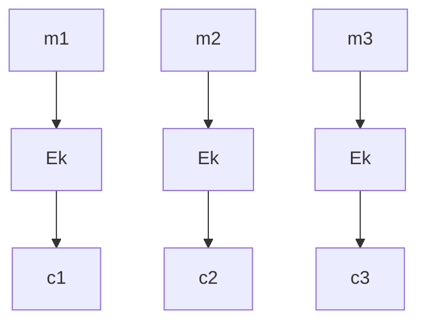

## WEEK V - Modes of Operation

>[🏠 MENU - 6CCS3CIS](year3/6ccs3cis.md)
>
>[⬅️ WEEK IV - Block Cipher](year3/6ccs3cis/w4.md)
>
>[➡️ WEEK VI - Introduction to Number Theory](year3/6ccs3cis/w6.md)
>
>Outlines:
>
>1. Randomness and Perfectness for Block Cipher
>1. Modes of Operation for SKE
>1. Modes of Operation for MAC

### 5.1. Randomness and Perfectness for Block Cipher

##### 5.1.1. Block Cipher and SKE

- Perfectness of a block cipher

  > e.g.
  >
  > Suppose a block cipher $F: \{0, 1\}^n \times \{0, 1\}^l \to \{0, 1\}^l$. Perfect means:
  >
  > - Inverting $F$ costs approximately $2^n$: The best attack is brute force.
  > - On a uniform $sk$ we cannot distinguish $F_{sk}$ from a uniform permutation.
  > - Effecient design in hardware and software? 

  - By a given perfect block cipher, we can build SKE and MAC. 

- Definition

  - A $\text{SKE = (KGen, Enc, Dec)}$ has $\mathcal{M, C, K}$ such that
    - $\text{KGen}$ returns a $sk$ sampled from $\mathcal{K}$,
    - For $m \in \mathcal{M}$ encryption is $\text{Enc}(sk, m) = c \in C$, 
    - For $c \in \mathcal{C}$ decryption is $\text{Dec}(sk, \text{Enc}(sk, m)) = m$. 
  - Correctness
    - For all $m \in \mathcal{M}, sk \in \mathcal{K}$, we have $\text{Dec}(sk, \text{Enc}(sk, m)) = m$.
  - Open
    - The algorithms of SKE are all public, only $sk$ is secret. 
  - Security (Intuition)
    - Adversaries cannot learn anything about the encrypted message given access to $\text{Enc}(sk, \cdot)$.
      - Let $sk \leftarrow \text{KGen}$ and $b \in \{0, 1\}$ sampled uniformly,
      - $\mathcal{A}$ with $\text{Enc}(sk, \cdot)$ outputs $m_0, m_1 \in \mathcal{M}$ of the same length,
      - $\mathcal{A}$ with $\text{Enc}(sk, \cdot)$ recevies $c = \text{Enc}(sk, m_b)$,
      - $\mathcal{A}$ outputs $b' \in \{0, 1\}$ and wins when $b = b'$.
    - If no adversaries win with probability (meaningfully) more than one half, then **$\text{SKE}$ is secure**. 

  > e.g.
  >
  > Given $F: \{0, 1\}^n \times \{0, 1\}^l \to \{0, 1\}^l$, then
  >
  > - $\text{KGen}$ samples $sk$ uniformly from $\{0, 1\}^n$,
  > - For $m \in \mathcal{M} = \{0, 1\}^l$, let $\text{Enc}(sk, m) = F_{sk}(m) \in \mathcal{C} = \{0, 1\}^l$, 
  > - For $c \in \mathcal{C}$, let $m = F_{sk}^{-1}(c)$. 
  >
  > For $m$ with different lengths, i.e., $\mathcal{M} = \{0, 1\}^*$, 
  >
  > 1. Unambiously pad $m$ to $m' \in \{0, 1\}^{\mathcal{U}}$
  > 2. Encrypted blcok by block? 

##### 5.1.2. Necessity of Randomness

- Motivation
  - Consider the scenarios that we want to use the encryption to win the security game.
    - Select any distinct $m_0, m_1$ of the same length, e.g., $m_0, m_1 \in \{0, 1\}^l$.
    - Learn $c_0 = \text{Enc}(sk, m_0), c_1 = \text{Enc}(sk, m_1)$ from the oracle,
    - $c = \text{Enc}(sk, m_0)$ will equal either $c_0$ or $c_1$, thus the message is not secure anymore. 
  - We CANNOT allow $\text{Enc}(sk, \cdot)$ to be **deterministic**. Since attacker can observe the pattern between deterministic encrypted ciphertext and plaintext. 
  - i.e., The encryption algorithm must be probablistic. 
- Solution
  - A function $f: X \to Y$ has no concept of randomness. Instead, we give the randomness as a **separate input**,
    - Let $\mathcal{R}=\{0, 1\}^p, f: X \times \mathcal{R} \to Y$, 
    - So called 'random coins' $\rho \in \mathcal{R}$ are sampled uniformly and $f(x; \rho)$. 
    - Attacker cannot know the message by observing the pattern of messages.
  - This means
    - Encrypting the same length message several times (should) give different ciphertexts, 
    - Therefore, to be able to decrypt, we must have $|\mathcal{C}| > |\mathcal{M}|$. 

---

### 5.2. Modes of Operation for SKE

##### 5.2.1. Electronic Code Book (ECB) Mode

- Definition
  - ECB is an encryption scheme for block ciphers. 
  - Each plaintext block $m_i$ is encrypted *independently* to ciphertext block $c_i$, i.e., $c_i = E_i(m_i)$. 

- Evaluation
  - Correctness (Exercise)
  - Open (Under your control)
  - (In)secure
    - If two plaintext blocks are same, the corresponding ciphertext blocks are same as well. Thus the attacker can analysis the pattern of encryption mapping method and the security cannot be guaranteed. 

##### 5.2.2. Cipher Block Chaining (CBC) mode

- Process

  - Encryption algorithm will sample a uniform $IV$ at first.

    - $F: \{0, 1\}^n \times \{0, 1\}^l$ is a block cipher, 

      $\mathcal{M}=\mathcal{C}=\cup_{i \in \mathbb{N}}\{0, 1\}^{il}$

      $\mathcal{K} = \{0, 1\}^n$

    - $\text{KGen}$ samples $sk$ uniformly from $\mathcal{K}$. 

  - $\text{Enc}(sk, m)$ for $m \in \{0, 1\}^{tl}$

    - Sample uniform $IV \in \{0, 1\}^l$ and parse $m = m_1, ..., m_t$ in $l$ bit blocks,
    - $c_0 = IV$
    - for $i \in \{1, ..., t\}$ let $c_i = F_{sk} (c_{i-1} ⊕ m_i)$ 

- Properties

  - Encryption
    - $\text{Enc}(sk, \cdot)$ uses randomness: $\mathcal{R} = \{0, 1\}^l, \text{Enc}(sk, \cdot ; \rho)$ for the $IV$. 
    - The ciphertexts are longer, $c_0 \in \{0, 1\}^l$ is added,
    - has to be computed **sequentially**, rather than in parallel.
  - Decryption
    - $\text{Dec}(sk, c)$ for $c \in \{0, 1\}^{(t+1)l}$
    - Parse $c = c_0 c_1 ... c_t$ as length $l$ blocks,
    - for $i \in \{1, ..., m\}$ let $m_i = c_{i-1} ⊕ F^{-1}_{sk}(c_i)$.
    - Decryption can be performed **in parallel**, and the $IV$ (i.e., $c_0$) is required.

- Evaluation

  - Correctness (exercise), 
  - Open (under your control), 
  - Secure - If $F$ is a good block cipher and $l$ is large enough.

##### 5.2.3. Counter Mode

- Definition

  - $F: \{0, 1\}^n \times \{0, 1\}^l \to \{0, 1\}^l$ is a block cipher, 

    $\mathcal{M = C = \cup_{i \in \mathbb{N}} \{0, 1\}^{il}}$

    $\mathcal{K} = \{0, 1\}^n$

  - $\text{Enc}(sk, m)$ for $m \in \{0, 1\}^{tl}$

    - sample uniform $IV \in \{0, 1\}^l$ and parse $m = m_1 ... m_t$ in $l$ bit blocks,
    - $c_0 = IV$,
    - for $i \in \{1, ..., t\}$ let $c_i = F_{sk}(IV + i) ⊕ m_i$. 

  - 

---

### 5.3. Modes of Operation for MAC

##### 5.3.1. Block Cipher and MAC

- Definition

##### 5.3.2. MAC-CBC

---

### 5.4. The Advanced Encryption Standard (AES)

##### 5.4.1. Definition