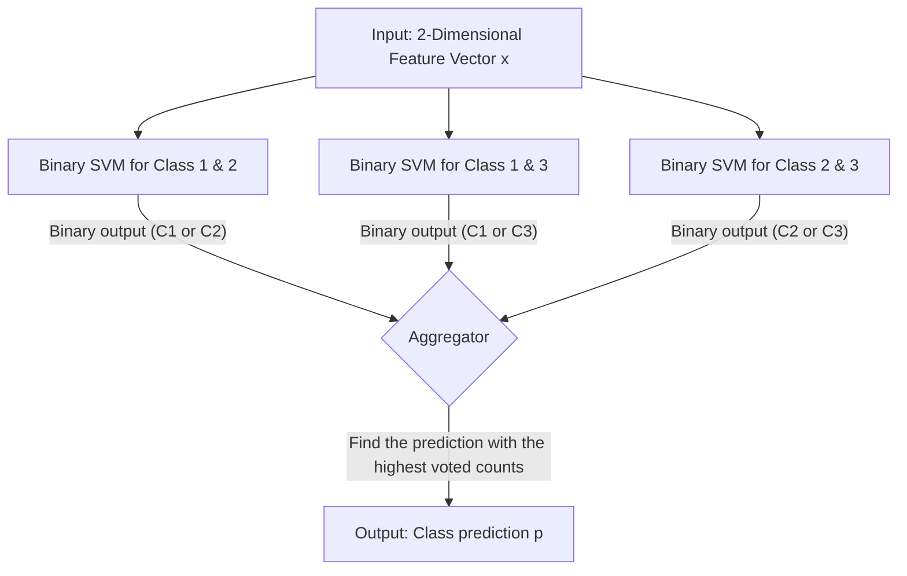

# 7CCSMPNN Coursework2 Report

## Yifei Shi

##### Q1. 

$$
[s_1,s_2, s_3, s_4, s_5, s_6, s_7] = [2, 1, 1, 3, 3, 2, 3, 9]
$$

---

##### Q2. 

$$
R_1 = (s_1 + s_2 + s_3 + s_4 + s_5 + s_6 + s_7) \mod 4 = 24 \mod 4 = 0 
$$

Thus, according to the table, we use the method of **one against one** for multi-class classification.  

---

##### Q3.

| Class 1          | Class 2          | Class 3          |
| ---------------- | ---------------- | ---------------- |
| (2, 5)       | (50, 10)       | (82, 10)    |
| (15, 18)       | (65, 15)      | (95, 18)      |
| (8, 10)       | (58, 11)      | (88, 10)      |
| (12, 9)       | (60, 14)      | (92, 15)      |
| (4, 13)       | (62, 5)       | (98, 8)      |
| (18, 10)       | (68, 10)      | (85, 13)      |
| (9, 16)       | (55, 13)      | (90, 19)      |
| (13, 7)       | (63, 8)       | (93, 13)      |
| (6, 12)       | (57, 17)      | (87, 12)      |
| (10, 15)       | (60, 12)      | (90, 14)      |

---

##### Q4. 


Here we show two figures that represents the distribution of the above dataset. The figure on the left shows the raw datapoints, and the figure on the right shows the datapoints with corresponding labels. The code is available below.

```python
import pandas as pd
import seaborn as sns
import matplotlib.pyplot as plt

data = {
    'Class 1': [
        (2, 5),
        (15, 18),
        (8, 10),
        (12, 9),
        (4, 13),
        (18, 10),
        (9, 16),
        (13, 7),
        (6, 12),
        (10, 15)
    ],
    'Class 2': [
        (50, 10),
        (65, 15),
        (58, 11),
        (60, 14),
        (62, 5),
        (68, 10),
        (55, 13),
        (63, 8),
        (57, 17),
        (60, 12)
    ],
    'Class 3': [
        (82, 10),
        (95, 18),
        (88, 10),
        (92, 15),
        (98, 8),
        (85, 13),
        (90, 19),
        (93, 13),
        (87, 12),
        (90, 14)
    ]
}

# Prepare a DataFrame for plotting.
# Combine all classes into one DataFrame with columns: x, y, and Class.
rows = []
for cls, points in data.items():
    for pt in points:
        rows.append({'x': pt[0], 'y': pt[1], 'Class': cls})
df = pd.DataFrame(rows)

# Plot the scatter plot with different colors and markers per class
plt.figure(figsize=(8, 6))
sns.scatterplot(data=df, x='x', y='y', hue='Class', style='Class', palette='deep', s=100)
plt.xlabel("X Coordinate")
plt.ylabel("Y Coordinate")
plt.show()

# Plot a second scatter plot with all points in black
plt.figure(figsize=(8, 6))
sns.scatterplot(data=df, x='x', y='y', color='black', s=100)
plt.xlabel("X Coordinate")
plt.ylabel("Y Coordinate")
plt.show()

```

The dataset is **linearly separable**, since

- Linearly separale means a linear function can be used to split different classes of datapoints in a dataset. Formally, in two dimension case, for each two pairs of data sets $C_i, C_j$, there exists a vector $\textbf{w}$ and real number $b$, such that there is a linear function $f(\textbf{x}) = \textbf{w}\textbf{x} + b$. For all the points $x_i \in C_i$, there exists $w_ix_i + b > 0$. For all the points $x_j \in C_j$, there exists $w_jx_j + b > 0$. 
- Our dataset is linearly separable, since we can find three linear functions as the hyperplanes to classify all the datapoints in three classes. For example, 

$$
\begin{matrix}
l_1: x = 32 &(C_1 \text{ vs. } C_2)\\
l_2: x = 78 &(C_1 \text{ vs. } C_3)\\
l_3: x = 53  &(C_2 \text{ vs. } C_3)\\
\end{matrix}
$$
​	is a group of decision boundaries. 

---

##### Q5. 



In one against one method, we train multiple binary SVM for multi-class classification tasks. 

Given a 3-class classification problem, where $R=3$. Thus, we train $\frac{R(R-1)}{2} = \frac{6}{2} = 3$ SVM respectively to each pair of classes in this three-class classification task. Given a 2D feature vector $\textbf{x}$ as input, each SVM gives a binary output $C \in \{C_1, C_2, C_3\}$, to vote for the prediction. 

The aggregator receives all the votes and pick the most frequently voted class as the final prediction. 

---

##### Q6. 

For binary classification problem, hyperplane can be represented as follows
$$
f(\textbf{x}) =\textbf{w}^T\textbf{x} + w_0 = 0, 
\text{where } \textbf{w} = 
\left[ 
\begin{matrix}
w_1 \\
w_2 \\
... \\
w_d
\end{matrix}
\right]
$$
We aim to find $\textbf{w}, w_0$ such that the margin is optimal. 

By inspection, we notice that the distribution of the first feature of three classes are demonstrated. Assume the feature vetor $\textbf{x} = \left( \begin{matrix} x \\ y \end{matrix} \right)$, then

For **Class 1 vs Class 2**:

1. We aim to identify the proper direction that yields the largest margin between the two classes. According to the graph, we can select one datapoint from both of the classes that could be the closest pair of points as candidate support vectors. Say, $a_1 = (18, 10), b_1 = (50, 10)$. The midpoint is then 
   $$
   m_1 = (\frac{18 + 50}{2}, \frac{10 + 10}{2}) = (34, 10)
   $$
   
2. We then find a direct vector diagonally devide datapoints from those two classes. The vector between the two points is then defined as 
   $$
   \vec{a_1b_1} = (50 - 18, 10 - 10) = (32, 0) \sim (1, 0)
   $$

3. Since we want to find the optimal hyperplane, whose normal vector is parallel to $\vec{a_1b_1}$. Thus, next step, we find the perpendicular vector to the vector $\vec{a_1b_1}$, with crossing the midpoint $m_1$. Assume the normal vector is $\textbf{w} = (1, 0)$, then the hyperplane is perpendicular with $x$-axis, and should be represent as $x = 34$. 
   
4. Thus, the margin is then $|34 - 18| + |34 - 50| = 32$, and the support vector is then $(18, 10)$ from Class 1, and $(50, 10)$ from Class 2. 

For **Class 1 vs Class 3**, 

1. Similairly, we find the pair of points as candidate support vectors. $a_2 = (18, 10), b_2 = (88, 10)$. The midpoint is then 
   $$
   m_2 = (\frac{18+88}{2}, \frac{10 + 10}{2}) = (53, 10)
   $$

2. We then find a direct vector diagonally devide datapoints from those two classes. The vector between the two points is then defined as 
   $$
   \vec{a_2b_2} = (88-18, 10-10) = (70, 0) \sim (1, 0)
   $$

3. Thus, next step, we find the perpendicular vector to the vector $\vec{a_2b_2}$, with crossing the midpoint $m_2$. Assume the normal vector is $\textbf{w} = (1, 0)$, then the hyperplane is perpendicular with $x$-axis, and should be represent as $x = 53$. 

4. Thus, the margin is then $|53 - 88| + |53 - 18| = 35$, and the support vector is then $(18, 10)$ from Class 1, and $(88, 10)$ from Class 3. 

For **Class 2 vs Class 3**, 

1. Similairly, we find the pair of points as candidate support vectors. $a_3 = (68, 10), b_3 = (88, 10)$. The midpoint is then 
   $$
   m_2 = (\frac{68+88}{2}, \frac{10 + 10}{2}) = (78, 10)
   $$

2. We then find a direct vector diagonally devide datapoints from those two classes. The vector between the two points is then defined as 
   $$
   \vec{a_3b_3} = (88-68, 10-10) = (20, 0) \sim (1, 0)
   $$

3. Thus, next step, we find the perpendicular vector to the vector $\vec{a_3b_3}$, with crossing the midpoint $m_2$. Assume the normal vector is $\textbf{w} = (1, 0)$, then the hyperplane is perpendicular with $x$-axis, and should be represent as $x = 78$. 

4. Thus, the margin is then $|78 - 88| + |78 - 68| = 20$, and the support vector is then $(68, 10)$ from Class 2, and $(88, 10)$ from Class 3. 

---

##### Q7. 

| Test Sample | Output of SVM 1 | Output of SVM 2 | Output of SVM 3 | Prediction |
| ----------- | --------------- | --------------- | --------------- | ---------- |
| (45, 8)     | $C_2$           | $C_1$           | $C_2$           | $C_2$      |
| (58, 17)    | $C_2$           | $C_3$           | $C_2$           | $C_2$      |
| (51, 10)    | $C_2$           | $C_1$           | $C_2$           | $C_2$      |
| (55, 13)    | $C_2$           | $C_3$           | $C_2$           | $C_2$      |
| (55, 9)     | $C_2$           | $C_3$           | $C_2$           | $C_2$      |
| (57, 11)    | $C_2$           | $C_3$           | $C_2$           | $C_2$      |
| (51, 16)    | $C_2$           | $C_1$           | $C_2$           | $C_2$      |
| (56, 9)     | $C_2$           | $C_3$           | $C_2$           | $C_2$      |
| (50, 14)    | $C_2$           | $C_1$           | $C_2$           | $C_2$      |
| (53, 14)    | $C_2$           | $C_3$           | $C_2$           | $C_2$      |

Basing on the results from **Q6**, we know that the hyperplane for the three SVMs are the following vertical lines:
$$
SVM_1: x = 34 \\
SVM_2: x = 78 \\
SVM_3: x = 53
$$
Take the prediction for the first test point for instance. 

- For SVM1, given an input $x_1 = (45, 8)$, since $45 - 34 > 0$, the output of SVM1 is then $C_2$, as we defined in **Q4**. 
- Similarily, for SVM2, since $45 - 78 < 0$, thus the output of SVM2 is $C_1$. 
- For SVM3, since $45-53<0$, thus the output is then $C_3$. 

As a result, the count of $C_2$ is 2, while the count of $C_1$ is 1, and the count of $C_3$ is 0. Thus, $C_2$ is the most voted class and it is the final prediction as a result. 
